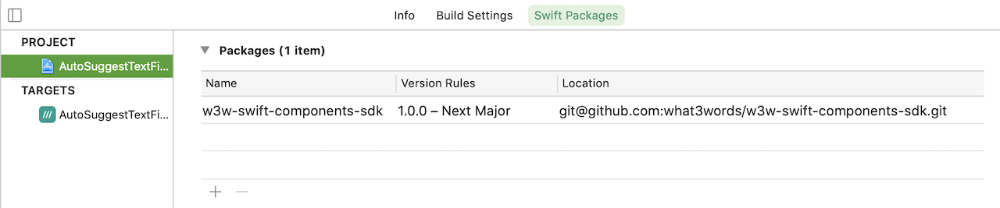

# &nbsp;w3w-swift-components-sdk

Overview
--------

what3words publishes a [compoonents library](https://github.com/what3words/w3w-swift-components) on GitHub.  Out of the box, it is designed to work with the what3words API.  

However, this package will extend the functionality of the Swift SDK so that it can use those components too.

Include this in your project, and it will provide some protocol extensions and cause the download of the [compoonents library](https://github.com/what3words/w3w-swift-components) into your project because it is a dependancy of this package.


Example: AutoSuggest Text Field
---------------------- 

`W3WAutoSuggestTextField` is a `UITextField` that will suggest three word addresses as the user types.  

Documentation for `W3WAutoSuggestTextField` as well as other components you may use can be found in the [components library](https://github.com/what3words/w3w-swift-components).

### Step 1:

Include `w3w.xcframework` in your Xcode project as per the `readme.txt` in the SDK package you recieved from what3words.

### Step 2:

Add this Swift Package to your project:



### Step 3:

Add the import statements to your ViewController's code:

```Swift
import w3w
import W3WSwiftApi
import W3WSwiftComponents
import W3WSwiftComponentsSdk
```

### Step 4:

Place this code in your ViewController's `viewDidLoad()`:

```Swift
override func viewDidLoad() {
  super.viewDidLoad()

  // the SDK
  let sdk = What3Words()
  
  // make the text field
  let textField = W3WAutoSuggestTextField(frame: CGRect(x: 16.0, y: 64.0, width: view.frame.size.width - 32.0, height: 32.0))
  
  // assign the SDK to it
  textField.set(sdk)
  
  // assign a code block to execute when the user has selected an address
  textField.suggestionSelected = { suggestion in
    print(suggestion.words ?? "")
  }
  
  // the error can be captured using onError 
  textField.onError = { error in
    print(String(describing: error))
  }
  
  // place in the view
  view.addSubview(textField)
}
```
This code is the same that you would use for the API, the only difference is the passing the SDK instead of the API to the component. Eg: `textField.set(What3Words())` instead of `textField.set(What3WordsV3(apiKey: "YourApiKey"))`

Take a look at the [compoonents library](https://github.com/what3words/w3w-swift-components) to see the other components available for use.

Technical Details
-----------------

what3words' SDK is a self contained framework of Swift code for 3 word addresses functionality.

* Objects in the SDK are prefixed with `W3WSdk`, for example, `W3WSdkSuggestion`, `W3WSdkOption`, etc...  
* Objects in the API are prefixed with `W3WApi`, such as `W3WApiSuggestion` and `W3WApiSquare`.  
* Both the SDK's and the API's objects are able to conform to our "main" protocols, eg: `W3WSuggestion`, `W3WOption`, `W3WSquare`, etc...

This package contains SdkToApiBridge.swift which makes the classes in the SDK conform to these "main" protocols.

Most importantly, all the component code uses only the "main" protocols and this allows both the API and the SDK to employ it.